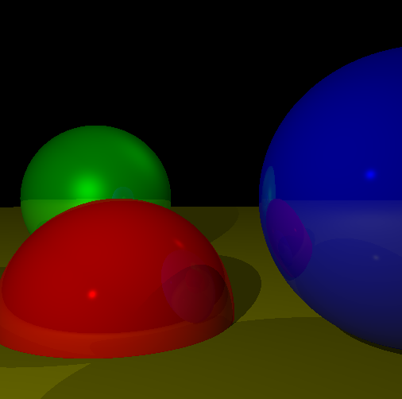

# CG-Scratch
There i will develop RayTracer and Resterizer from scratch using C++, without any graphics API: OpenGL, DX, Vulkan and so on.

*Used materials: Gabriel Gambetta book "Computer Graphics from Scratch" https://www.gabrielgambetta.com/computer-graphics-from-scratch/*

**MY PLAN:**

1) *Math*                                                                                          
   a) 2D Vector class - **done**
   b) 3D Vector class - **done**
   b) Matrices 4x4 - **done**                                   
   
2) *RayTracer:*                                  
   a) Raytracing simple spheres - **done**                         
   b) Light them - **done**                                                    
   c) Shadows and reflections - **done**                                           
   d) Camera arbitrary positioning - **done**
   
   *TODO: Parallelization, caching immutable values, other primitives support, transparency, refraction, constructive solid geometry*
   
   **Final Screenshot**   
   
  
   
3) *Rasterizer*                                               
   a) Lines - **done**                        
   b) Filled Triangles - **done**                               
   c) Shaded Triangles - **done**                                         
   d) Perspective Projection - **done**                                     
   e) Describing and Rendering a Scene - **done**                                                                                 
   f) Clipping - **done**                                                                                                                                 
   g) Hidden Surface Removal - **debugging**                                                                                  
   h) Shading                                                                                  
   i) Textures                                                                                  
   *TODO: ....       
   
   **Final screenshot**
   
